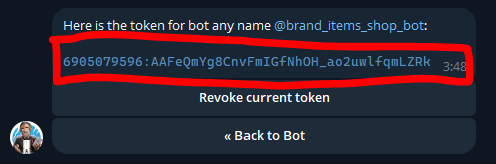

# Создание ботов в Telegram и Facebook

## Создание бота в Telegram

1. Находим в поисковике @BotFather  
   

2. В диалоге с ним используем команду /newbot  
   

3. @BotFather предлагает как-то назвать бота, называем его как хотим

4. Далее нужно придумать юзернейм для бота, обязательно, чтобы оно заканчивалось на bot, например, test_twenty_one_bot или brand_items_shop_bot. ВАЖНО, юзернейм должен быть уникален, если вдруг окажется, что юзернейм занят, @BotFather об этом скажет и попросит придумать другой

5. После создания бота нужно воспользоваться командой /mybots, высветится менюшка в которой будут кнопки (в вашем случае всего одна), на кнопка написано имя пользователя бота, нажимаем на кнопку, чтобы открыть меню управления ботом и нажимаем API Token, высвечивается окно с токеном, нажимаешь на токен и он копируется, далее его нужно отложить в какой-нибудь блокнот и сохранить на потом, потому что он пригодится при хостинге бота  
     
     
     

## Создание бота в Facebook

*В разработке...*
