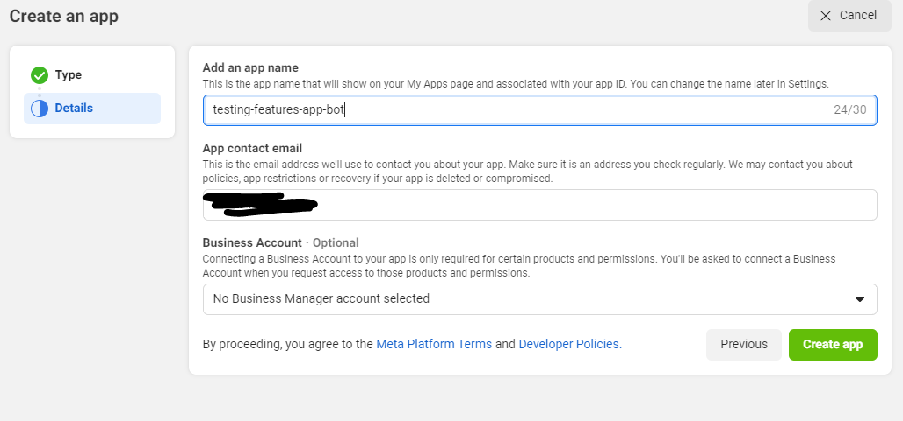
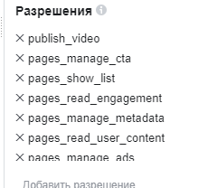

# Creating bots in Telegram and Facebook

## Create a bot in Telegram

1. Find @BotFather in the search engine  
   

2. In the dialog with him use the command /newbot  
   

3. @BotFather suggests naming the bot somehow, we call it whatever we want to call it

4. Next we need to come up with a username for the bot, make sure it ends with bot, for example, test_twenty_one_bot or brand_items_shop_bot. IMPORTANT, the username must be unique, if it suddenly turns out that the username is busy, @BotFather will tell you about it and ask you to come up with another one

5. After creating a bot you need to use the command /mybots, you will see a menu where there will be buttons (in your case, just one), on the button is written the username of the bot, click on the button to open the bot management menu and click API Token, a window with a token appears, click on the token and it is copied, then it should be put aside in some notebook and save for later, because it will come in handy when hosting the bot.  
     
     
     

## Create a Facebook bot

1. Go to https://developers.facebook.com/, look for the Get Started section on the top right, click on  
   

2. Register as a developer, go through all the steps, at the last step specify yourself as a Developer  

3. After registration we will be redirected to the application window (if not redirected, go to https://developers.facebook.com/apps/).  
   

4. Click on the Create App button, select Other  
   

4.1. select the Business application type  
   

4.2 Choose the name of the application, for example testing-features-app-bot and create the application (if confirmation is required, enter the password from the page).  
   

5. After creating the app, we are taken to the main page of the created app  
   

5.1 On the top of the navigation field, hover over the Tools section and select Graph API Explorer.  
     
   

5.2 We get to the API testing window  
   

5.3 In this section, select the "User or Page" field and select Get Page AccessToken.  
     
   

5.4 We get to such a window. In this window you click Continue as ... 
     
   We get to the next window, in which you select your page  
     

5.5. After that you need to select permissions like in these pictures.  
     
     
   (to add permissions click on the Add a Permission button or in the input field above this button manually enter the names of permissions from the pictures.

5.6 After that click Generate Access Token button, once the token is generated this tool can sometimes generate an incorrect token so as in step 5.3 select our page again, after that the token will be updated, nothing needs to be clicked after selecting the page except the blue icon next to the Access Token.  
   

5.7. In the window that appears, click the blue button that starts with the words "Extend", click it, a new token appears, copy it to the same place where you saved the token from the Telegram bot.  
   

6. Go to your page, to which we want to parse data from the telegram channel.

7. Select the About tab  
   

8. Select the Page Transparency section and look for Page Id there, copy it to the same place where you saved all tokens.  
   

9. Preparations are ready! Now we need to install the bot using these data!
