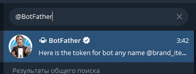
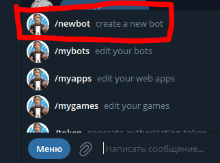
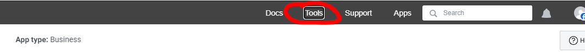
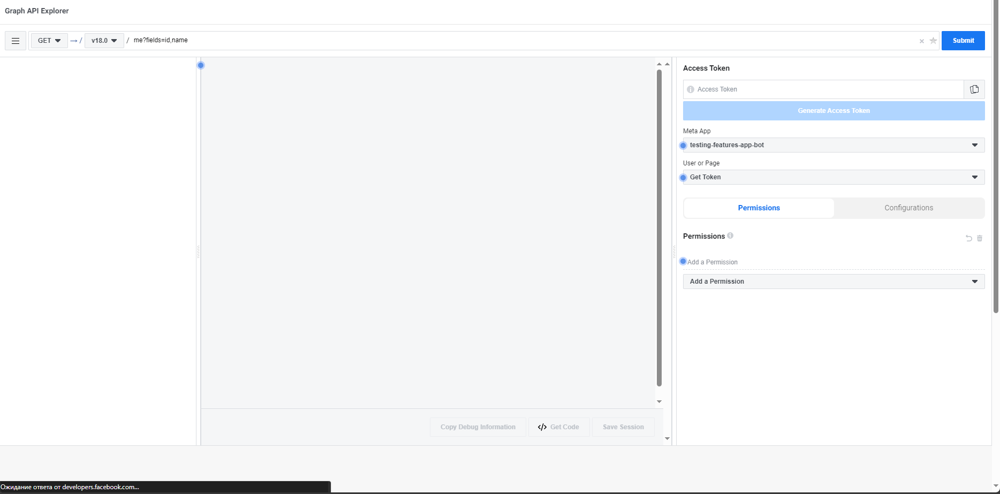
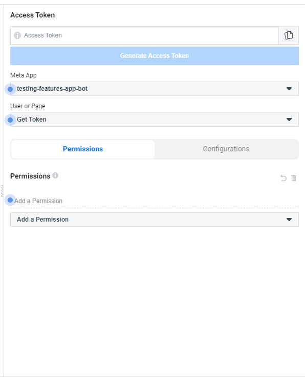
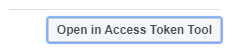
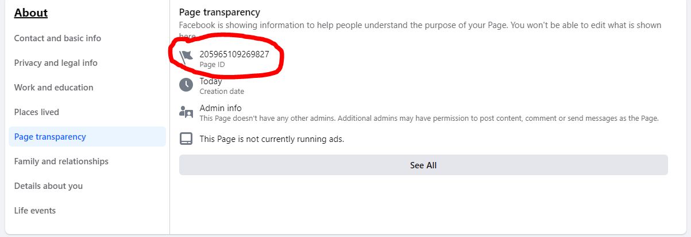

# Создание ботов в Telegram и Facebook

## Создание бота в Telegram

1. Находим в поисковике @BotFather  
   

2. В диалоге с ним используем команду /newbot  
   

3. @BotFather предлагает как-то назвать бота, называем его как хотим

4. Далее нужно придумать юзернейм для бота, обязательно, чтобы оно заканчивалось на bot, например, test_twenty_one_bot или brand_items_shop_bot. ВАЖНО, юзернейм должен быть уникален, если вдруг окажется, что юзернейм занят, @BotFather об этом скажет и попросит придумать другой

5. После создания бота нужно воспользоваться командой /mybots, высветится менюшка в которой будут кнопки (в вашем случае всего одна), на кнопка написано имя пользователя бота, нажимаем на кнопку, чтобы открыть меню управления ботом и нажимаем API Token, высвечивается окно с токеном, нажимаешь на токен и он копируется, далее его нужно отложить в какой-нибудь блокнот и сохранить на потом, потому что он пригодится при хостинге бота  
     
     
     

## Создание бота в Facebook

1. Переходим на сайт https://developers.facebook.com/, ищем раздел Get Started сверху справа, нажимаем  
   

2. Регистрируемся как разработчик, проходим все этапы, на последнем этапе указываем себя как Developer  

3. После регистрации нас перекидывает на окно приложения (если не перекинуло, то перейти по адресу https://developers.facebook.com/apps/)  
   

4. Нажимаем на кнопку Create App, выбираем Other  
   

4.1. Выбираем тип приложения Business  
   

4.2. Выбираем название приложения, например testing-features-app-bot и создаём приложение (если потребуется подтверждение, вводим пароль от странички)  
   

5. После создания приложения нас перекидывает на главную страницу созданного приложения  
   

5.1. Вверху на навигационном поле наводим на раздел Tools и выбираем Graph API Explorer  
     
   

5.2. Попадаем на окно тестирования API  
   

5.3. В этом разделе выбираем поле "User or Page" и выбираем там Get Page AccessToken  
     
   

5.4. Попадаем в такое окно. В этом окне нажимаешь Continue as ... 
     
   Попадаем в следующее окно, в которой выбираем свою страницу  
     

5.5. После этого надо выбрать разрешения такие же как на этих картинках  
     
     
   (чтобы добавить разрешения нажимаем на кнопку Add a Permission или в поле для ввода выше этой кнопки вводим вручную названия разрешений с картинок.

5.6. После этого нажимаем кнопку Generate Access Token, как токен будет сгенерирован данный инструмент иногда может выдать неправильный токен поэтому, как в шаге 5.3 снова выбираем нашу страницу, после этого токен обновится, ничего нажимать после выбора страницы не надо, кроме как синего значка напротив Access Token  
   

5.7. В появившемся окне мотаем в самый низ, находим синюю кнопку которая начинается с слов "Extend", нажимаем, у нас появляется новый токен, копируем его туда же, где сохраняли токен от бота телеграмма  
   

6. Заходим на свою страницу, на которую желаем парсить данные с телеграм канала.

7. Выбираем вкладку About  
   

8. Выбираем раздел Page Transparency и ищем там Page Id, копируем его туда же, куда и сохранили все токены.  
   

9. Приготовления готовы! Осталось захостить бота используя эти данные!

